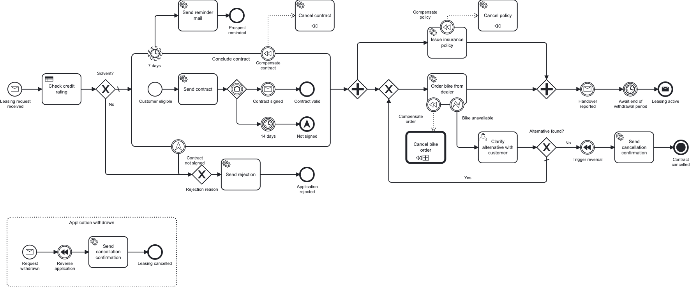

# CIB seven Bike-Leasing Blueprint

> [!NOTE]
> **🚧 Work in progress.** A **solution template** to fork and build on — not a product that ships.
> Expect it to keep evolving.

A ready-to-fork **starting point** for automating a business process on
[CIB seven](https://cibseven.org) (the community fork of Camunda 7) with an **embedded engine** and
Spring Boot — one complete, runnable, production-shaped BPMN service, in two equivalent stacks.

## Pick your stack

| | [`kotlin-gradle/`](kotlin-gradle/README.md) | [`java-maven/`](java-maven/README.md) |
|---|---|---|
| **Stack** | Kotlin 2.4 · Gradle | Java 21 · Maven |
| **Choose it when** | you are free to choose — **our recommendation for a modern stack** | Java + Maven is your team's or company's standard, or you are in a training |

Both run the same process, expose the same REST contract and pass the same end-to-end scenarios. They
share the BPMN/DMN models, forms and database schema in [`shared/`](shared/README.md), so
only the implementation language and the build tool differ. Building on one? Delete the other directory.

## The scenario

**MiraVelo** is a (fictional) bike brand that sells on a **leasing model**. This service automates a
leasing application from the first request to an active lease — and deliberately walks through the
**broad palette of BPMN elements you meet in real processes**, not just a happy-path service task:



- **message start event**, **service tasks** (JavaDelegates) and a **DMN business-rule task**
- **embedded sub-process** with an **event-based gateway** and a non-interrupting **reminder timer**
- **parallel fork/join**, and a **user task with a Camunda Form** — completable in the Tasklist or via REST
- **execution** and **task listeners**, wired as Spring beans like the delegates
- **compensation / SAGA** handlers guarded by **error** and **escalation** boundary events
- **call activity**, **message event sub-process** (withdrawal) and a **terminate end event**

## Run it

You need **JDK 21** and **Docker** (or Podman).

```bash
docker compose -f stack/docker-compose.yml up -d              # Postgres

cd kotlin-gradle && ./gradlew :service:app:bootRun            # either the Kotlin variant …
cd java-maven && ./mvnw -DskipTests install \
  && ./mvnw -pl service/app spring-boot:run                   # … or the Java variant, both on :8080
```

Then open the Cockpit / Tasklist at <http://localhost:8080/camunda> (admin/admin) or the Swagger UI at
<http://localhost:8080/swagger-ui.html>, and drive the whole process over REST:

```bash
cd bruno && npx --yes @usebruno/cli@4.0.0 run . --env local -r
```

## What's where

```
kotlin-gradle/   the service in Kotlin + Gradle (recommended)
java-maven/      the same service in Java 21 + Maven
shared/          BPMN + DMN models, Camunda Forms, Flyway migrations — one source for both
openapi/         the checked-in, drift-gated OpenAPI contract both variants must produce
bruno/           REST scenarios that run against either variant
stack/           Postgres dev stack (docker compose)
docs/            Architecture Decision Records + diagrams
```

## Go deeper

- **The code, its build and its quality gates** — [`kotlin-gradle/README.md`](kotlin-gradle/README.md) ·
  [`java-maven/README.md`](java-maven/README.md)
- **The process models and how both builds consume them** — [`shared/README.md`](shared/README.md)
- **The scenarios, the two ways to complete a user task, and the incident demo** —
  [`bruno/README.md`](bruno/README.md)
- **Why the repo is shaped this way** — the [Architecture Decision Records](docs/README.md)
- **Setup, ports, containers and the PR workflow** — [`CONTRIBUTING.md`](CONTRIBUTING.md)

## License

Licensed under the [MIT License](./LICENSE).
