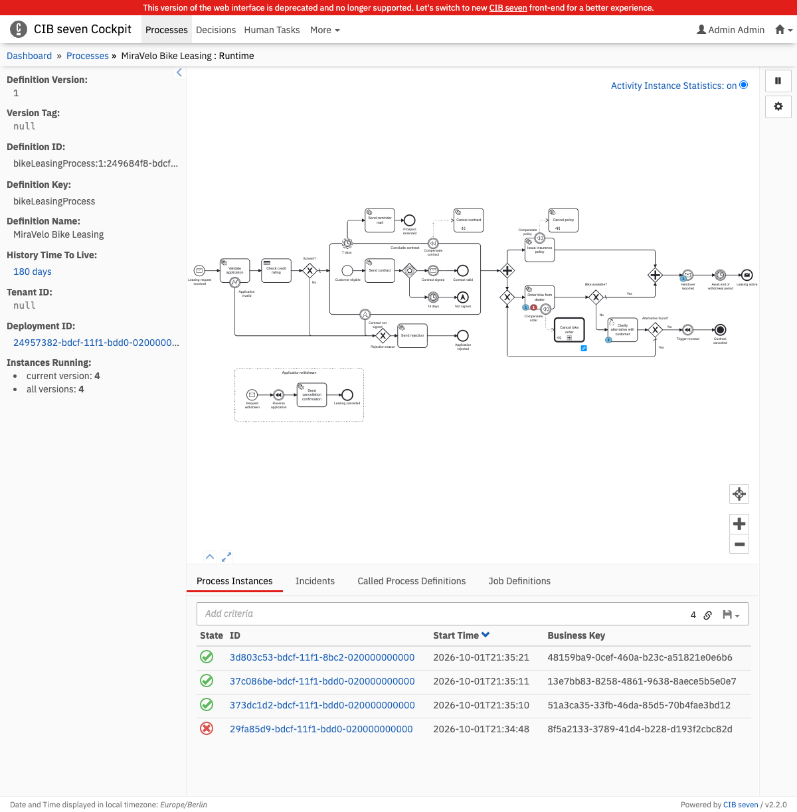
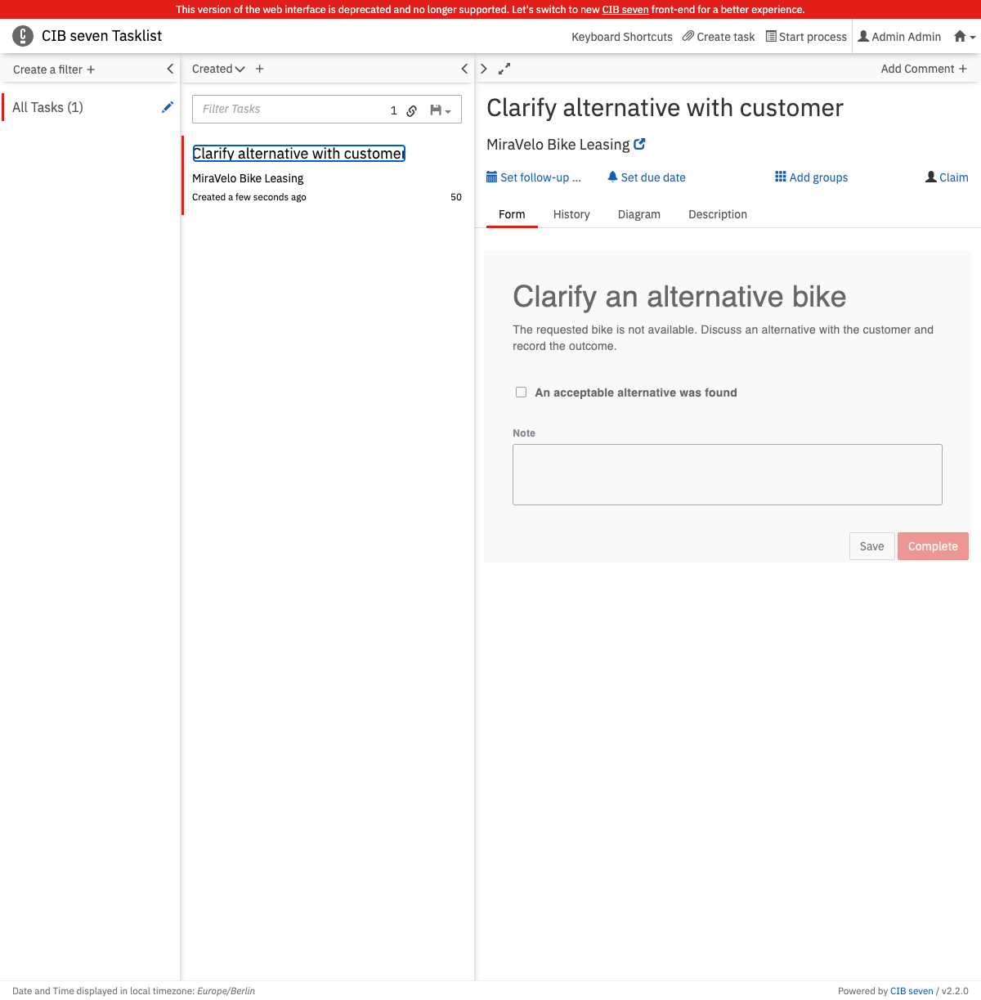

# Spike — embedded CIB seven as a GraalVM native image

**Question:** can this service — Spring Boot 4.1 with an embedded CIB seven 2.2 engine, `/engine-rest`
and Cockpit / Tasklist — run as a GraalVM native image without losing anything?

**Answer:** yes on macOS/arm64, with a small amount of glue and no change to process models or
business code. **Not yet proven on Linux**, and not recommended as the default.

Spike of 2026-10-01, tag `spring-native-spike`. Details, commands and evidence:
[technical notes](technical-notes.md).

## Result

| | JVM | Native |
|---|---|---|
| Ready, existing database | 4.5 – 4.6 s | 0.73 – 0.74 s |
| Ready, empty database | 4.9 – 5.1 s | 0.92 – 0.94 s |
| Memory (RSS) idle / after the scenarios | ~970 / ~950 MB | ~340 / ~410 MB |
| Build, application only | 2 s | 137 s, peaking at 14 GB of RAM |
| Artifact | 135 MB jar | 407 MB executable |
| All Bruno scenarios (45 requests, 80 assertions) | pass | pass |

One machine, three runs each — an observation, not a benchmark.

The native executable passes the same acceptance run as the jar (`scripts/e2e.sh`): every Bruno
scenario, the engine's read APIs, a user task with its deployed form, and a restart in the middle of
a process instance. Seven process scenarios also run inside a native test image (`nativeTest`).
Cockpit and Tasklist were checked in a browser:

| Cockpit | Tasklist with a Camunda Form |
|---|---|
|  |  |

## What it took

Everything is opt-in behind `-Pnative`; the JVM build is untouched. No dependency was upgraded.

- **Runtime hints** — CIB seven and MyBatis ship no GraalVM metadata, Jersey only part of it. Five
  registrars open about 6,000 types by package and embed the resources the engine loads by name.
- **AOT injection** — nine CIB seven beans are declared by interface, so Spring AOT skipped their
  `@Autowired` fields and the engine failed to start. A post-processor replays the injection.
- **Auto-deployment** — starter and engine call `Resource.getFile()`, which a native image does not
  support; nothing was deployed, and nothing was logged as an error. Replaced by a file-free variant.
- **Webapp plugin scripts** — Cockpit stayed blank because Tomcat cannot serve them from the webjar
  natively. Only the browser check revealed it. The native build copies them to the fallback path.

All of it lives in `service/app/src/main/kotlin/…/adapter/process/nativeimage` and
`service/app/build.gradle.kts`.

## What is not proven

- **Linux and the container image.** `bootBuildImage` is configured for the native lane but was never
  run — the container VM on the spike machine was too small. This is the first gap to close.
- **Throughput under load.** No JIT, and GraalVM Community only has the serial collector.
- **The rest of the webapps.** Two views each were opened; more defects like the blank Cockpit may hide
  in the others.

## Risks to know

- Unsupported by CIB seven. The workarounds lean on its internals and must be re-tested natively on
  every upgrade.
- A missing hint is not a build error. It shows at run time, on the affected path only.
- Bean conditions and profiles are frozen at build time, e.g. `camunda.bpm.job-execution.enabled`.
- Mock-based tests cannot run natively: 7 of 176 tests run in the native image.
- The native-image builder crashed in 2 of 26 builds.

## Recommendation

1. Keep the JVM image as the default, here and in the sibling blueprints. A process engine starts
   rarely and runs for weeks — start-up time is seldom its bottleneck.
2. Native pays off for scale-to-zero, many small engines side by side, or preview environments.
3. If the opt-in lane is kept, it needs a nightly Linux CI job, or it rots with the next upgrade.
4. Take the findings upstream to CIB seven: precise `@Bean` return types, no `Resource.getFile()`,
   reachability metadata.
5. Blueprints with a *remote* engine are the better first candidates for native.

## Try it

```bash
export GRAALVM_HOME=/path/to/graalvm-25
docker compose -f stack/docker-compose.yml up -d

./gradlew -Pnative :service:app:nativeTest       # process scenarios in a native test image
./gradlew -Pnative :service:app:nativeCompile    # -> service/app/build/native/nativeCompile/app
scripts/e2e.sh native                            # acceptance run against the executable
```
